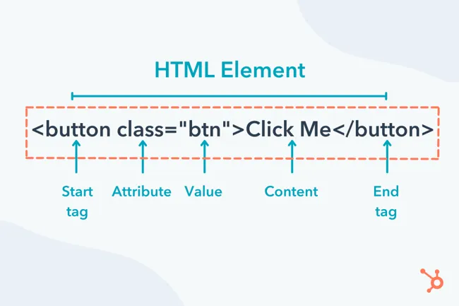
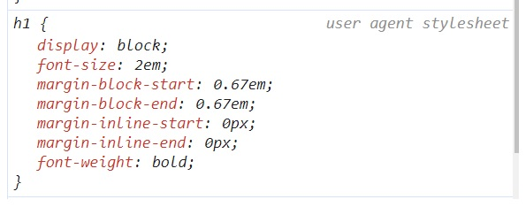
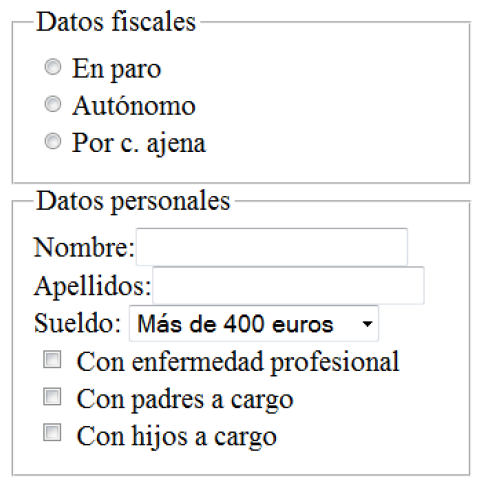
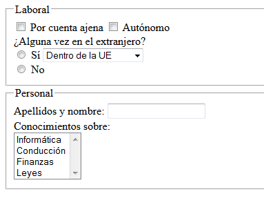
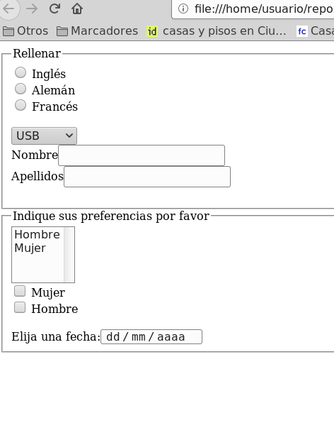

# HTML

[Invitación a HTML Classroom](https://classroom.google.com/c/NTg4NjkwMjYyODkw?cjc=nbgwbhr)

[Invitación a VSC Classroom](https://classroom.google.com/c/NTg0Nzk5MTEzNTkx?cjc=kc36k4h)


[Guías Bluuweb, HTML Fundamentos](https://bluuweb.dev/01-html/)

[Guía Buuweb, HTML intermedio](https://bluuweb.dev/01-html/02-html-intermedio.html)


__Tabla de contenidos__

- [¿Qué es HTML?](#¿qué-es-html)
- [Comentarios en HTML](#comentarios-en-html)
- [Etiquetas de formato](#html-format-tags)
- [Etiquetas de encabezado](#head-tags)
- [Enlaces e imágenes](#anchor-and-image-tags)
- [Listas ordenadas/desordenadas](#list-tags)
- [Etiquetas semánticas](#etiquetas-semánticas)
- [Etiquetas no semánticas](#etiquetas-no-semánticas-divisions-tags)
- [Etiquetas de formulario](#control-form-tags)
- [Ejercicios de refuerzo](#ejercicios-de-refuerzo)
 

## ¿Qué es HTML?

<dl>
    <dt>
        <abbr title="Hipertext Language Markup">HTML</abbr>
    </dt>
    <dd>
    <abbr title="Hypertext Markup Language">HTML</abbr> como indica su acrónimo (<em>Hipertext Markup Language</em>) es un <strong>lenguaje de marcas</strong> (ML) para describir la <strong>estructura</strong> de una página web. 
    </dd>
</dl>

En resumen __HTML__:
- Utiliza __tags__
- Por la característica anterior se le llama (Hypertext) __markup language__
- __Estructura__ contenido

El inventor de <abbr title="Hypertext Markup Language">HTML</abbr> fue __Tim Berners-Lee__. Y entre otros logros se encuentran __git__ o el _protocólo_ __http__


### Nomenclatura 



### Atributos globales

Todos los elementos pueden tener dichos atributos.

Ejemplos:

- id
- class
- lang
- hidden

### Atributos específicos

Son propiedades particulares de un o unos pocos elementos HTML

Ejemplos:

- name
- src
- alt

### Hola mundo

Ejemplo básico de una __página web__, en este caso [hello world](hellow-world.html):

```html
<!DOCTYPE html>
<html lang="es">
<head>
  <meta charset="UTF-8">
  <meta name="viewport" content="width=device-width, initial-scale=1.0">
  <title>Mi primera página WEB</title>
</head>
<body>
  <h1>Hello World!!!</h1>
</body>
</html>
```

### Qué NO es HTML

- Lenguaje de presentación. Esto es, no estiliza o diseña el contenido de una página

El diseño que observamos en el __user agent__ o navegador se debe a que estos programas llevan integrados sus propias __hojas de estilo__, el lenguaje que da estilo a las páginas.



## Comentarios en HTML

En cualquier lenguaje a los programadores les gusta realizar comentarios en el propio documento con el fin de recordar, reseñar información que no sea visible. En HTML el comentario tiene la siguiente forma:

    <!-- Este es un comentario -->


## HTML format tags

```html
<strong>Texto importante</strong>
<em>Texto enfatizado</em>
<mark>Texto marcado</mark>

<p>
    Este es un párrafo <strong>que contiene texto importante</strong> y además de
    <del>texto eliminado</del>.
</p>

<hr />

<s>Texto tachado</s>
<del>Texto eliminado</del>
<ins>Texto insertado</ins>
<sub>Texto de subíndice</sub>
<sup>Texto en superíndice</sup>
```

## Head tags

```html
<h1>Título principal de nuestro sitio web.</h1>
<h2>Utilízala en los encabezados de secciones.</h2>
<h3>Utilízala en sub-secciones.</h3>
<h4>Utilízala en sub-sub-secciones. o como estimes conveniente</h4>
<h5>Más de lo mismo...</h5>
<h6>No existe el "<h7>" por lo tanto está es la última.</h6>
```

## Anchor and image tags

### Anchors o links

```html
<a href="https://youtube.com/bluuweb">Ir a página de Google</a>
```

El enlace podemos forzar que abrá a una pestaña nueva utilizando el __atributo__ _target_

```html
<a target="_blank" rel="noreferrer" href="https://youtube.com/bluuweb">Ir a página de Google</a>
```
En el ejemplo de arriba utilizamos un atributo __rel__ con el valor de __noreferrer__. Esto se debe a motivos de seguridad: al abrir una pestaña nueva, que es la página de destino, se puede obtener información de la página de origen.

### Images

```html

```

## List tags

```html
<!-- Unordered List -->
<ul>
    <li>Elemento 1</li>
    <li>Elemento 2</li>
    ...
    <li>Elemento N</li>
</ul>

<!-- Ordered List. Con atributos que son opcionales -->
<ol reversed type="1">
    <li>HTML</li>
    <li>CSS</li>
    <li>JavaScript</li>
    <li value="5">mySQL</li>
</ol>

<!-- Definition List -->
<dl>
    <dt><abbr title="Hipertext Markup Language">HTML</abbr></dt>
    <dd>
        Se trata de un acrónimo es un "lenguaje de marcas" (ML) para <em>estructurar</em> (las propias etiquetas son semánticas) el contenido en dichas marcas
    <dd>
</dl>
```

## Etiquetas semánticas

Hasta ahora hemos visto unas cuantas __etiquetas semánticas__, estos es, son __tags__ que otorgan significado al contenido que vamos creando en nuestras páginas web.

En __HTML5__ disponemos de nuevas etiquetas que dotan de significado a nuestras web y con lo que solemos construir nuestros __layouts__ (estructura principal de nuestra página):


### Atributo role

A parte de las __etiquetas semánticas__ cuando no sabemos que tipo asignar a un elemento disponemos del __atributo role__. Por ejemplo

```html
<div role="alert">Este es un mensaje de alerta</div>
```

## Etiquetas no semánticas (Divisions tags)

```html
<div>Block element.</div>
<span>Inline element.</span>
```

## Tablas

```html
<!-- RECUERDA QUE PONER EL atributo "border" ES MALA PRÁCTICA -->
<table border='1'>
    <caption>Titulo de la tabla</caption>
    <!-- Encabezado -->
    <thead>
        <tr>
            <th>Mascota</th>
            <th>Edad</th>
            <th>Color</th>
        </tr>
    </thead>
    <!-- Pie de tabla -->
    <tfoot>
        <tr>
            <th>Mascota</th>
            <th>Edad</th>
            <th>Color</th>
        </tr>
    </tfoot>
    <!-- contenido -->
    <tbody>
        <tr>
            <td>Gato</td>
            <td>3 años</td>
            <td>Negro</td>
        </tr>
        <tr>
            <td>Perro</td>
            <td>1 mes</td>
            <td>Azul</td>
        </tr>
    </tbody>
</table>
```
## Control form tags

- [Forms, apuntes Xurxo](https://drive.google.com/file/d/1OB9VaxghLiUYWOD1yshYLRkYaFqhTWIV/view?usp=sharing)
- [Form control input, de bluuweb](https://bluuweb.dev/01-html/02-html-intermedio.html#input-1)
- [Si quieres practicar en casa, aquí ejercicios resueltos.](https://oscarmaestre.github.io/lenguajes_marcas/ejercicios/formularios/anexo_formularios.html)

```html
<form action="/admin.php" method="post">
<label for="curso">Curso: </label>
<input id="curso" type="text" placeholder="Ingrese un curso" name="curso" />
<button type="submit">Enviar</button>
</form>

```

## Ejercicios de refuerzo

1. A partir de la siguiente captura elaborar el documento HTML correcto


- [Enlace al texto](./text.txt)
- [Enlace de etiquetas](https://allthetags.com/)
- Puedes utilizar la herramienta [www.w3chools.com](https://www.w3schools.com/html/tryit.asp?filename=tryhtml_default)

2. Recrear la lista de la imagen


3. Recrear la siguiente captura de pantalla


Consideraciones

- La ruta de la imagen es en remoto y es la siguiente:
https://www.w3.org/html/logo/downloads/HTML5_Badge_512.png

- El botón nos llevará a la siguiente dirección:
https://www.youtube.com/bluuweb

4. Ejercicio. Recrea la siguiente imagen


5. Descárgate el siguiente [fichero](./pruebas-tecnicas/02-etiquetas-semanticas.html) y coloca las etiquetas semánticas correspondientes.


6. Crea un formulario como este donde haya 3 opciones en la lista desplegable: «Más de 400», «Menos de 400», «Variables»




7. Crea un formulario como este




8. Generar el formulario siguiente de acuerdo a los siguientes requisitos:

    - Contiene los siguientes radiobuttons:radio con el name «idioma» , value «idiomaingles» y el texto «Inglés», radio con el name «idioma» , value «idiomaaleman» y el texto «Alemán», radio con el name «idioma» , value «idiomafrances» y el texto «Francés».
    - Hay una lista desplegable con el name «conector» y con las siguientes opciones: opción «USB» con el value usb, opción «Paralelo» con el value paralelo, opción «PS2» con el value ps2.
    - Hay los siguientes cuadros de texto:cuadro de texto con el texto «Nombre» y el name nombre, cuadro de texto con el texto «Apellidos» y el name apellidos
    - Hay una lista desplegable múltiple con el name «sexo» y con las siguientes opciones: opción «Hombre» con el value hombre, opción «Mujer» con el value mujer.
    - Contiene los siguientes checkboxes:checkbox con el name «sexo» , value «sexomujer» y el texto «Mujer», checkbox con el name «sexo» , value «sexohombre» y el texto «Hombre».
    - Hay un control para indicar la fecha.



## Pruebas de conocimiento

- [Prueba técnica 1](./pruebas-tecnicas/01-prueba-conocimientos.md)

